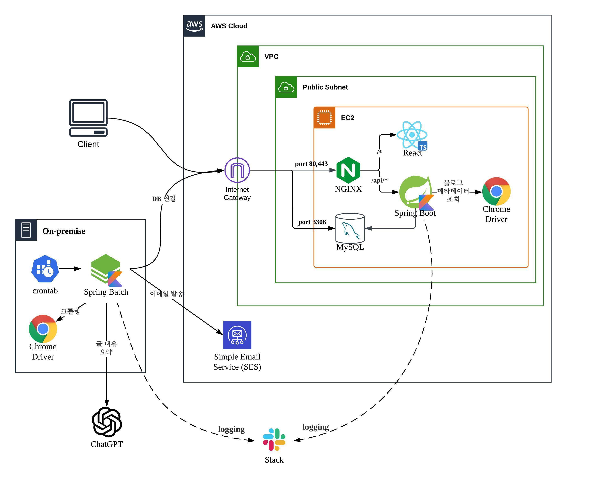

<h1 align="middle">블로그 구독/요약 서비스 Blogzip</h1>
<br>

## 기능
- 비회원 사용자는 운영자가 선정한 블로그들의 요약본을 볼 수 있다.
- 회원은 블로그를 검색하여 구독할 수 있고, 없다면 직접 추가가 가능하다.
- 회원은 블로그에 올라온 새 글의 요약본을 매일 아침 이메일로 받아볼 수 있다.
- 회원은 게시글을 나중에 읽을 수 있도록 저장할 수 있다.
- 서비스 주소 : https://blogzip.co.kr/

## 기술 스택
### 백엔드
- Kotlin, Java, Gradle
- Spring Boot, JPA, MySQL
- Spring Batch
- Selenium, Jsoup
- OpenAI API
- AWS SES, Thymeleaf
### 프론트엔드
- React, TypeScript, Material-ui
### 인프라
- AWS EC2
### ETC
- Google OAuth2, JWT

## 인프라 아키텍쳐


## 백엔드 모듈 구조
```
backend
├── api : API 서버 애플리케이션 모듈
├── batch : 배치 애플리케이션 모듈
├── domain : 도메인 로직과 DB과의 연결 담당
├── crawler : 크롤링과 ChatGPT API 호출 담당
├── notification : 이메일 발송 담당
└── logging : slack으로 로그 메시지 발송 담당
```