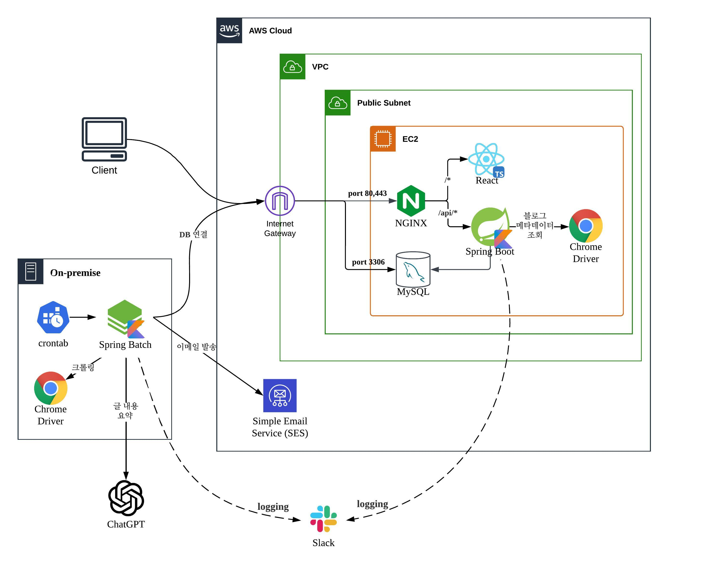

<h1 align="middle">블로그 구독/요약 서비스 Blogzip</h1>
<br>

## 기능
- 비회원은 운영자가 선정한 블로그들의 요약본을 볼 수 있다.
- 회원은 블로그를 검색하여 구독할 수 있고, 없다면 URL로 직접 추가가 가능하다.
- 회원은 블로그에 올라온 새 글의 요약본을 매일 아침 이메일로 받아볼 수 있다.
- 회원은 게시글을 나중에 읽을 수 있도록 저장할 수 있다.
- 서비스 주소 : https://blogzip.co.kr

## 기술 스택
### 백엔드
- Kotlin, Java, Gradle
- Spring Boot, JPA, MySQL
- Spring Batch
- Selenium, Jsoup
- OpenAI API
- Spring Mail, Thymeleaf
### 프론트엔드
- React, TypeScript, Material-ui
### 인프라
- OCI Compute, OCIR, OCI Vault
### ETC
- Google OAuth2, JWT

## CI/CD
- `master` 브랜치에 머지되면 GitHub Actions가 `api`, `nginx`, `batch` Docker 이미지를 빌드해서 레지스트리에 업로드합니다.
- 같은 워크플로우에서 운영 VM에 SSH로 접속해 최신 `api`, `nginx` 이미지를 `docker compose`로 재배포합니다.
- `batch`는 파라미터가 필요한 일회성 잡이라 자동 상시 배포 대신, `Run Batch Job` 워크플로우에서 최신 이미지를 받아 실행합니다.

### 한 번만 해두면 되는 서버 준비
1. 운영 VM에 Docker Engine + Docker Compose plugin을 설치합니다.
2. 운영 VM에 OCI CLI를 설치합니다.
3. `/opt/blogzip/compose/.env.api` 파일을 만들고 `MYSQL_HOST`, `MYSQL_PORT`, `MYSQL_DATABASE`, `OCI_REGION`, `OCI_VAULT_ID` 값을 채웁니다.
4. 인증 모드는 기본 `OCI_CLI_AUTH=instance_principal`(기본값)이며, 필요하면 `OCI_CLI_AUTH`, `OCI_CONFIG_FILE`, `OCI_CLI_PROFILE` 값을 `.env.api`에 추가해 override 할 수 있습니다.
5. SMTP endpoint 관련 비민감 값(`OCI_EMAIL_SMTP_HOST`, `OCI_EMAIL_SMTP_PORT`, `OCI_EMAIL_FROM_NAME`, `OCI_EMAIL_FROM_ADDRESS`)은 `.env.api`에 두거나 Vault Secret으로 관리할 수 있습니다.
6. 컨테이너가 VM의 로컬 MySQL에 붙어야 하면 `MYSQL_HOST=host.docker.internal` 로 둡니다.
7. 80 포트를 외부에 열고, 필요하면 443은 로드밸런서나 리버스 프록시에서 종료합니다.
8. `nginx` 컨테이너가 TLS 종료를 수행하므로 VM에 Certbot 인증서가 있어야 합니다.
9. 아래 파일이 VM에 존재해야 합니다.
- `/etc/letsencrypt/live/blogzip.co.kr/fullchain.pem`
- `/etc/letsencrypt/live/blogzip.co.kr/privkey.pem`
- `/etc/letsencrypt/options-ssl-nginx.conf`
- `/etc/letsencrypt/ssl-dhparams.pem`

### OCI Vault 연동 (prod, local-prod)
- 앱이 직접 Vault를 import 하지 않고, 배포 스크립트(`deploy/scripts/fetch-vault-env.sh`)가 Vault Secret을 읽어 `deploy/compose/.env.runtime`을 생성한 뒤 컨테이너에 주입합니다.
- `local` 프로파일은 Vault를 사용하지 않고, 필요한 값을 로컬 환경변수로 직접 주입해서 실행합니다.
- 기본 Vault 인증: `instance_principal` (필요 시 `.env.api`에서 `OCI_CLI_AUTH`로 변경 가능)
- 필수 환경변수: `OCI_REGION`, `OCI_VAULT_ID`
- Vault Secret 이름은 아래 환경변수 키와 동일하게 생성해야 합니다.
- `JWT_SECRET_KEY`
- `GOOGLE_CLIENT_SECRET`
- `ADMIN_TOKEN`
- `MYSQL_USERNAME`
- `MYSQL_PASSWORD`
- `OCI_EMAIL_SMTP_USERNAME`
- `OCI_EMAIL_SMTP_PASSWORD`
- `OPEN_AI_API_KEY`
- `OPEN_AI_ASSISTANT_ID`
- `OPEN_AI_THREAD_ID`
- `SLACK_WEBHOOK_URL`
- 아래 값은 `.env.api` 또는 Vault Secret 중 편한 방식으로 관리할 수 있습니다.
- `OCI_EMAIL_SMTP_HOST`
- `OCI_EMAIL_SMTP_PORT`
- `OCI_EMAIL_FROM_NAME`
- `OCI_EMAIL_FROM_ADDRESS`

### GitHub 설정
- Repository Variables
- `IMAGE_PREFIX`: 예) `icn.ocir.io/<tenancy-namespace>/blogzip`
- `REGISTRY_HOST`: 예) `icn.ocir.io`
- Repository Secrets
- `REGISTRY_USERNAME`
- `REGISTRY_PASSWORD`
- `DEPLOY_HOST`
- `DEPLOY_USER`
- `DEPLOY_SSH_KEY`

## 인프라 아키텍쳐


## 백엔드 모듈 구조
```
backend
├── api : API 서버 애플리케이션 모듈
├── batch : 배치 애플리케이션 모듈
├── domain : 도메인 로직과 DB과의 연결 담당
├── crawler : 크롤링과 ChatGPT API 호출 담당
├── notification : 이메일 발송 담당
└── logging : slack으로 로그 메시지 발송 담당
```
